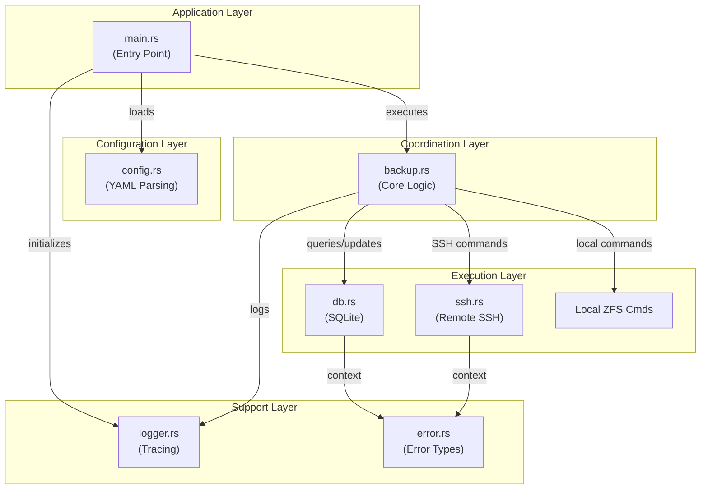
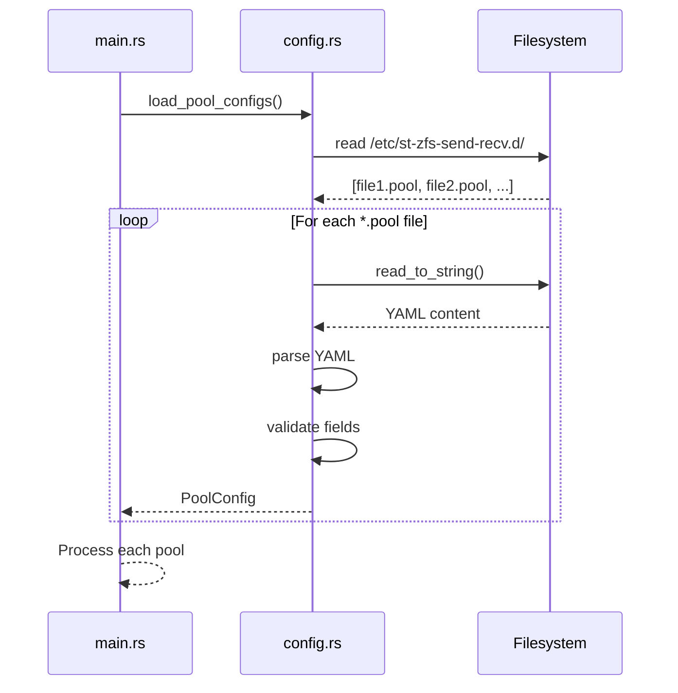
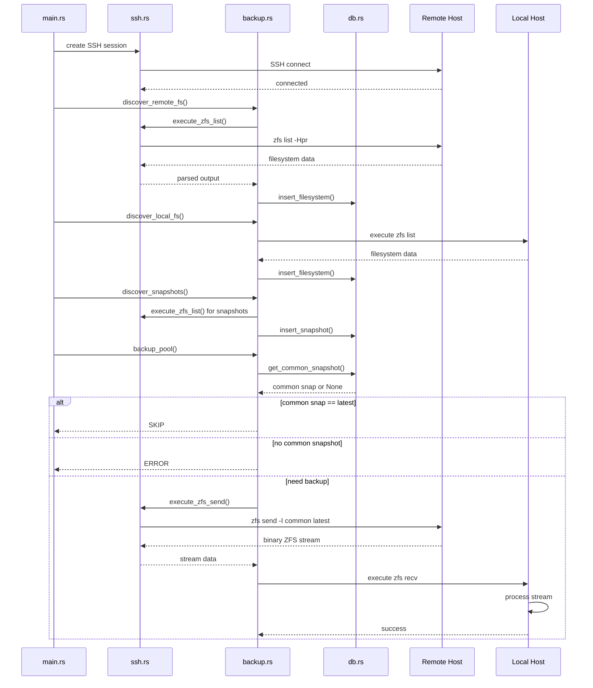
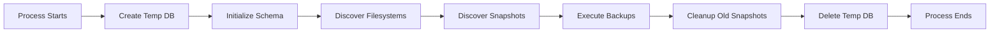
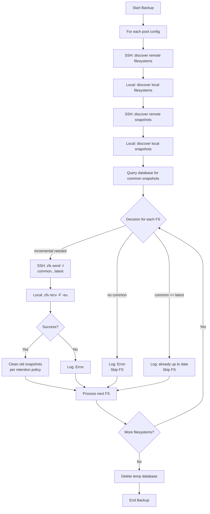
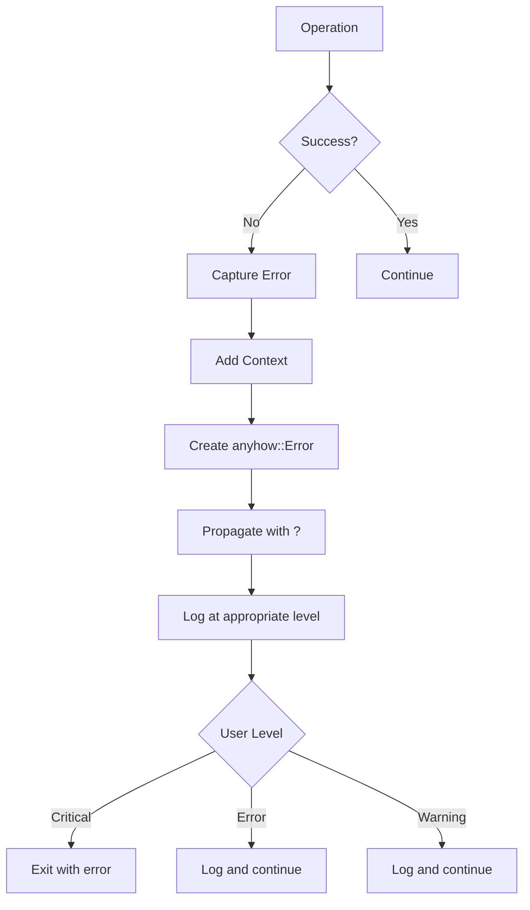
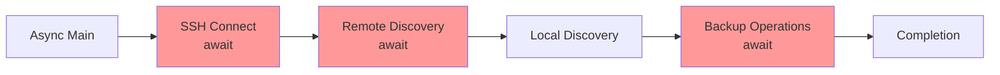

# st-zfs-send-recv Internals

A comprehensive technical guide to the internal architecture and operation of the st-zfs-send-recv Rust implementation.

## Table of Contents

1. [Architecture Overview](#architecture-overview)
2. [Module Structure](#module-structure)
3. [Data Flow](#data-flow)
4. [State Management](#state-management)
5. [Backup Algorithm](#backup-algorithm)
6. [Error Handling](#error-handling)
7. [Concurrency Model](#concurrency-model)

---

## Architecture Overview

The st-zfs-send-recv application follows a modular, layered architecture designed for clarity, testability, and maintainability.



---

## Module Structure

### main.rs - Orchestration
**Purpose**: Application entry point and high-level workflow coordination

**Responsibilities**:
- Initialize logging system
- Load pool configurations from `/etc/st-zfs-send-recv.d/`
- Process each pool configuration sequentially
- Handle cleanup and error reporting

**Key Functions**:
- `main()` - Entry point, async runtime initialization
- `process_pool()` - Process a single pool configuration
- `verify_remote_privileges()` - Check SSH privileges
- `discover_and_backup()` - Orchestrate discovery and backup

**Key Data**:
```rust
pool_config: PoolConfig  // Configuration for one pool
```

### config.rs - Configuration Management
**Purpose**: YAML configuration parsing and validation

**Responsibilities**:
- Load and parse YAML configuration files
- Validate required fields
- Apply default values
- Provide structured configuration objects

**Key Structures**:
```rust
pub struct PoolConfig {
    pub remote_host: String,           // SSH target
    pub remote_pool: String,           // Source ZFS pool
    pub local_pool: String,            // Destination ZFS pool
    pub compress: String,              // Compression algorithm
    pub keep_snapshots: Vec<KeepPolicy>,
    pub skip_filesystems: Vec<String>,
}

pub struct KeepPolicy {
    pub count: u32,                    // Number to keep
    pub label: String,                 // Snapshot label
}
```

**Key Functions**:
- `load_pool_configs()` - Load all `.pool` files
- `load_pool_config()` - Parse single YAML file
- `validate_pool_config()` - Validate required fields

### db.rs - State Management
**Purpose**: SQLite database operations for filesystem and snapshot tracking

**Responsibilities**:
- Create and initialize temporary database
- Parse ZFS command output into structured data
- Query filesystem and snapshot metadata
- Determine backup strategy (common snapshots, etc.)

**Database Schema**:
```sql
fs_src      -- Remote filesystems (pool, guid, creation, type, used, name)
fs_dst      -- Local filesystems (same fields)
snap_src    -- Remote snapshots (parent_guid, guid, snapshot name, etc.)
snap_dst    -- Local snapshots (same fields)
```

**Key Structures**:
```rust
pub struct Filesystem {
    pub guid: String,        // Unique identifier
    pub creation: String,    // Creation timestamp
    pub fs_type: String,     // filesystem or volume
    pub used: String,        // Space used
    pub name: String,        // Full path
}

pub struct Snapshot {
    pub parent_guid: String, // Parent filesystem GUID
    pub guid: String,        // Snapshot GUID
    pub snapshot: String,    // Snapshot name part after @
}
```

**Key Queries**:
- `get_common_snapshot()` - Find most recent snapshot on both sides
- `get_remote_newest_snapshot()` - Latest remote snapshot
- `get_filesystems()` - List all filesystems in pool
- `get_fs_property()` - Query filesystem properties

### ssh.rs - Remote Operations
**Purpose**: SSH session management and remote command execution

**Responsibilities**:
- Establish SSH connection to remote host
- Execute remote ZFS commands
- Handle binary ZFS stream data
- Detect and handle sudo requirements

**Key Structure**:
```rust
pub struct SshSession {
    session: Session,       // openssh Session
    host: String,          // SSH hostname
    use_sudo: bool,        // Whether sudo is needed
}
```

**Key Methods**:
- `new()` - Establish SSH connection
- `check_root_privileges()` - Verify remote user permissions
- `execute_zfs_list()` - Run remote `zfs list` commands
- `execute_zfs_send()` - Run remote `zfs send` (returns binary data)

**Implementation Notes**:
- Uses async/await via Tokio
- Openssh crate handles SSH protocol
- Automatic sudo detection and fallback

### backup.rs - Core Backup Logic
**Purpose**: Implements incremental backup algorithm

**Responsibilities**:
- Discover filesystems and snapshots on both sides
- Determine backup strategy for each filesystem
- Coordinate ZFS send/recv operations
- Manage snapshot retention

**Key Functions**:
- `discover_remote_fs()` - Query remote ZFS filesystems
- `discover_local_fs()` - Query local ZFS filesystems
- `discover_snapshots()` - Query snapshots for all filesystems
- `backup_pool()` - Main backup orchestration
- `backup_filesystem()` - Backup single filesystem
- `perform_incremental_backup()` - Execute send/recv pipeline

**Backup Decision Tree**:
```
For each filesystem:
  common_snap = query common snapshot
  remote_snap = query newest remote snapshot
  
  if common_snap == remote_snap:
    -> SKIP (already up to date)
  else if no common_snap:
    -> ERROR (requires manual initialization)
  else:
    -> BACKUP (incremental from common to remote)
```

### logger.rs - Logging
**Purpose**: Structured logging configuration

**Responsibilities**:
- Initialize tracing subscriber
- Configure log levels via RUST_LOG
- Format and output logs

**Implementation**:
- Uses `tracing` crate for structured logging
- Outputs to stderr
- Supports environment-based configuration

### error.rs - Error Handling
**Purpose**: Custom error types and context

**Key Types**:
```rust
pub enum ZfsBackupError {
    #[error("SSH error: {0}")]
    SshError(String),
    
    #[error("Database error: {0}")]
    DatabaseError(#[from] rusqlite::Error),
    
    #[error("ZFS command failed: {0}")]
    ZfsCommandFailed(String),
    
    // ... more variants
}

pub type ZfsResult<T> = Result<T, ZfsBackupError>;
```

**Error Propagation**:
- Use `.context()` from anyhow to add context
- Use `?` operator for propagation
- Log errors at appropriate levels

---

## Data Flow

### Configuration Loading Flow



### Backup Execution Flow



> **Implementation note (verified against `src/ssh.rs` and `src/backup.rs`):** the diagram above shows `zfs send` and `zfs recv` as if they were connected by a live pipe. The current code does not do that: `SshSession::execute_zfs_send` (`src/ssh.rs:84`) calls `.output().await`, which waits for the remote `zfs send` to finish and buffers its **entire** stdout into a `Vec<u8>` client-side (on the backup host) before returning. `perform_incremental_backup` (`src/backup.rs:276`) then spawns `zfs recv` locally and writes that buffer to its stdin — a `stream data` step followed by a *separate* `execute zfs recv` step, not concurrent halves of one pipe. See the [timing example](#timing-example-gantt) below for what this means in practice, and [Memory Usage](#memory-usage) for the RAM implication.

---

## State Management

### Database Lifecycle



### Temporary Database

**Created**: At start of each pool processing
**Location**: System temp directory (`/tmp/`)
**Name Pattern**: `{pool-name-sanitized}-XXXXXXXX.db`

**Populated**:
1. `fs_src` - from `zfs list` on remote
2. `fs_dst` - from `zfs list` locally
3. `snap_src` - from `zfs list -t snapshot` on remote (1000 most recent)
4. `snap_dst` - from `zfs list -t snapshot` locally (1000 most recent)

**Used For**:
- Determining common snapshots
- Finding latest snapshots
- Filtering filesystems based on skip_filesystems
- Tracking filesystem metadata (GUID, creation time, space used)

**Deleted**: After successful backup completion

---

## Backup Algorithm

### High-Level Algorithm



### Incremental Backup Mechanics

For a given filesystem:

1. **Find Common Snapshot**
   ```sql
   SELECT snapshot FROM snap_src
   JOIN snap_dst ON snap_src.guid = snap_dst.guid
   WHERE parent_guid matches filesystem
   ORDER BY creation DESC LIMIT 1
   ```

2. **Find Latest Remote Snapshot**
   ```sql
   SELECT snapshot FROM snap_src
   WHERE parent_guid matches filesystem
   ORDER BY creation DESC LIMIT 1
   ```

3. **Send Incremental Stream**
   ```bash
   zfs send -I pool/fs@common pool/fs@latest | compress
   ```

4. **Receive on Local**
   ```bash
   uncompress | zfs recv -F -eu local_pool/fs
   ```

5. **Cleanup Old Snapshots**
   - For each retention policy (e.g., daily, weekly, monthly)
   - Keep N most recent matching label
   - Destroy older snapshots with matching label

> **Implementation note:** steps 3–5 above describe the target design from `PROMPT.md`, not the current `src/backup.rs`. Today: step 3 runs `zfs send -I` with **no** compression stage (`PoolConfig.compress`/`compress_flags` are parsed from YAML but never read by `backup.rs`); step 4 runs plain `zfs recv` with **no** decompression stage (`uncompress_flags` is likewise unused); and step 5 does not exist at all — `keep_snapshots` is parsed but no `zfs-auto-snapshot --destroy-only` call is ever made. These are open items, not implemented behavior — see [Extensibility Points](#extensibility-points).

### Timing Example (Gantt)

The sequence diagram above shows *what* happens; the chart below estimates *how long*, and on which host, for one representative pool with three filesystems (`tank/data`, already in sync; `tank/new`, no common snapshot; `tank/logs`, needs a ~2 GiB incremental). Assumptions: effective SSH throughput ≈ 40 MB/s, local write throughput on the backup pool ≈ 150 MB/s. Real durations scale linearly with the actual delta size and available bandwidth — treat the numbers as illustrative, not a benchmark.

```mermaid
gantt
    title st-zfs-send-recv — actual operation sequence (pool "tank")
    dateFormat  HH:mm:ss
    axisFormat  %M:%S
    todayMarker off

    section Local host (backup server)
    Start, init logging (tracing)               :b1, 00:00:00, 1s
    Load pool configs (*.pool)                  :b2, after b1, 1s
    Verify local root privileges (geteuid)      :b3, after b2, 1s
    Create temp SQLite DB (tempfile)             :b4, after b3, 1s
    Initialize SQLite schema (4 tables)          :b5, 00:00:07, 1s
    Discover local filesystems (zfs list)        :b6, 00:00:10, 1s
    Discover local snapshots (loop per fs)       :b7, 00:00:14, 1s
    tank/data: already in sync -> skip           :milestone, b8, 00:00:15, 1s
    tank/new: no common snapshot -> error        :crit, milestone, b9, 00:00:16, 1s
    tank/logs: incremental needed                :b10, 00:00:17, 1s
    zfs recv -F -eu (writes buffered stream)     :crit, b11, 00:01:08, 14s
    Delete temp SQLite DB                        :b12, after b11, 1s
    Exit                                          :b13, after b12, 1s

    section Network / SSH channel
    Open SSH session (handshake + auth)          :n1, 00:00:04, 2s

    section Remote host (source server, via SSH)
    Verify privileges (root or sudo)             :s1, after n1, 1s
    Discover remote filesystems (zfs list)       :s2, 00:00:08, 2s
    Discover remote snapshots (loop, 3 fs)       :s3, 00:00:11, 3s
    zfs send -I daily-01 daily-02 (buffered)     :crit, s4, 00:00:18, 50s
```

Total: **~84s**, of which **76% (64s of 84s)** is a single filesystem's `zfs send` → `zfs recv` pair — marked `crit` because they run **sequentially, not overlapped**: `zfs recv` cannot start until `zfs send` has finished and the whole stream has been buffered in memory on the backup host (see the implementation note above). With a true concurrent pipe, that segment would take `max(50s, 14s) = 50s` instead of `50s + 14s = 64s`, and the gap widens with the delta size. No compression or retention-cleanup steps appear in the chart because, as noted above, neither is wired into `backup.rs` today. Pools and filesystems are processed strictly one at a time — no parallelism (see [Concurrency Model](#concurrency-model)).

---

## Error Handling

### Error Flow



### Error Categories

| Error Type | Handling | Example |
|-----------|----------|---------|
| **Configuration** | Fail immediately | Invalid pool name, missing remote_host |
| **SSH Connection** | Log error, skip pool | Network unreachable |
| **Remote ZFS** | Log error, skip filesystem | zfs command not found |
| **Local ZFS** | Log error, skip filesystem | zfs recv failed |
| **Database** | Log error, continue | Query failure (logged but non-fatal) |

### Context Propagation

```rust
// Low level
ssh.execute_zfs_list(&args)
    .await
    .context("Failed to execute zfs list")?

// Mid level
backup_filesystem(&args)
    .await
    .context("Failed to backup filesystem")?

// High level
process_pool(&config)
    .await
    .context("Failed to process pool")?
```

---

## Concurrency Model

### Async/Await Design

The application uses Tokio for async I/O without multi-threading (by default):



**Why Async?**
- SSH operations have network latency
- Allows future parallelization of multiple pools
- Non-blocking I/O for responsiveness

**Sequential Processing**
- Pools processed one at a time
- Filesystems within a pool processed sequentially
- Suitable for cron-based backup jobs

**Future Opportunities for Parallelization**:
- Process multiple pools concurrently
- Parallel snapshot discovery per filesystem
- SSH connection pooling

---

## Lifetime and Resource Management

### Session Lifecycle

```
Program Start
    ↓
Initialize Logging
    ↓
Load Configuration
    ↓
For Each Pool:
    ├─ Create Temp Database
    ├─ Establish SSH Session
    ├─ Discover & Backup
    ├─ Clean Old Snapshots
    ├─ Close SSH Session
    └─ Delete Temp Database
    ↓
Exit
```

### File Handles

- **SSH Session**: One per pool (closed after processing)
- **Database Connection**: One per pool (temporary file)
- **Subprocess Handles**: Created and destroyed for each ZFS command

### Memory Usage

- Streaming snapshot lists (1000 at a time max)
- Database results streamed where possible
- **Binary ZFS stream data is fully buffered in memory on the backup host**, not piped: `SshSession::execute_zfs_send` collects the entire `zfs send` output into a `Vec<u8>` before `zfs recv` even starts (see the [implementation note](#backup-execution-flow) and [timing example](#timing-example-gantt)). For very large incremental deltas (100GB+, an edge case `PROMPT.md` explicitly calls out) this means a transient RAM spike on the backup host roughly proportional to the delta size, not a bounded block-sized buffer.

---

## Key Design Decisions

### 1. Temporary SQLite Database
**Decision**: Use temporary in-memory-like SQLite DB for state tracking
**Rationale**:
- Clean separation of concerns
- Can query filesystem relationships efficiently
- Enables intelligent backup decisions
- Self-contained per pool (no persistent state)

### 2. Async SSH with Tokio
**Decision**: Use Tokio async runtime for SSH operations
**Rationale**:
- SSH operations have high latency
- Non-blocking allows future parallelization
- Modern Rust best practices
- Ready for multi-pool concurrent processing

### 3. Sequential Pool Processing
**Decision**: Process pools one at a time
**Rationale**:
- Simple, predictable behavior
- Suitable for cron-based automation
- Can run multiple instances for parallelism
- Clear error attribution

### 4. YAML Configuration
**Decision**: YAML instead of bash variables
**Rationale**:
- Human-readable structure
- Type-safe parsing
- Easy validation
- Extensible for future options

### 5. No Persistent State
**Decision**: All state ephemeral (no backup catalog)
**Rationale**:
- Simple, no corruption issues
- ZFS is source of truth
- Compatible with any existing backups
- Reduces operational complexity

---

## Performance Characteristics

### Time Complexity

| Operation | Complexity | Notes |
|-----------|-----------|-------|
| Filesystem discovery | O(n) | n = number of filesystems |
| Snapshot discovery | O(n × m) | n = filesystems, m ≤ 1000 snapshots |
| Common snapshot query | O(1) | Indexed query on GUID |
| ZFS send/recv | O(Δ) | Δ = changed data size |

### Space Complexity

| Component | Complexity | Notes |
|-----------|-----------|-------|
| Database | O(n × m) | n filesystems × m snapshots |
| SSH buffers | O(block_size) | Streaming, not full data (for `zfs list` output) |
| ZFS stream | O(Δ) | Fully buffered in RAM on the backup host before `zfs recv` starts — see [Memory Usage](#memory-usage) |

### Typical Performance

- **Binary compilation**: 40 seconds (optimized build)
- **Single pool backup**: 1-5 minutes (network dependent)
- **Database initialization**: < 100ms
- **Discovery phase**: < 1 second per pool
- **Memory usage**: 30-50 MB

---

## Extensibility Points

### Adding Features

1. **New Configuration Options**
   - Add field to `PoolConfig` struct
   - Add YAML parsing in `config.rs`
   - Pass to relevant module

2. **New ZFS Commands**
   - Add method to `SshSession`
   - Add method to local ZFS wrapper
   - Call from `backup.rs`

3. **Retention Policies**
   - Extend `KeepPolicy` struct
   - Add matching logic in `backup.rs`
   - Implement cleanup command

4. **Additional Logging**
   - Use `tracing::info!()`, `debug!()`, etc.
   - Control via `RUST_LOG` environment variable

---

## Debugging Tips

### Enable Verbose Logging
```bash
RUST_LOG=debug /usr/local/bin/st-zfs-send-recv
RUST_LOG=trace /usr/local/bin/st-zfs-send-recv
RUST_LOG=st_zfs_send_recv::backup=trace /usr/local/bin/st-zfs-send-recv
```

### Database Inspection
The temporary database is created in `/tmp/` with pattern `{pool}--XXXXXXXX.db`

```bash
# Find temp database
find /tmp -name "*.db" -newer /tmp -type f

# Inspect contents
sqlite3 /tmp/backup--tank-XXXXXXXX.db
sqlite> SELECT * FROM fs_src;
sqlite> SELECT * FROM snap_src;
```

### SSH Debugging
```bash
# Test SSH command
ssh -v backup.example.com zfs list

# Check SSH session directly
ssh backup.example.com "zfs list tank; zfs list -t snapshot tank"
```

### Trace Backup Decision
The database queries reveal the decision path:

```bash
# Log shows:
# - Filesystems discovered
# - Snapshots discovered
# - Common snapshot (if found)
# - Decision (skip/backup/error)
```

---

## Related Documentation

- [README.md](README.md) - User guide
- [INSTALL.md](INSTALL.md) - Installation guide
- [DEVELOPMENT.md](DEVELOPMENT.md) - Development guide
- [CHANGELOG.md](CHANGELOG.md) - Version history

---

**Version**: 2.0.0  
**Last Updated**: 2024-01-XX  
**Status**: Production Ready
